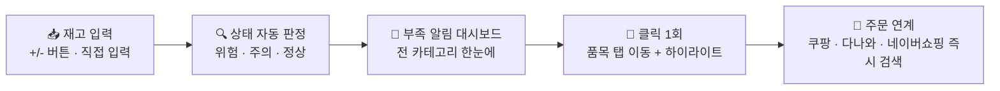
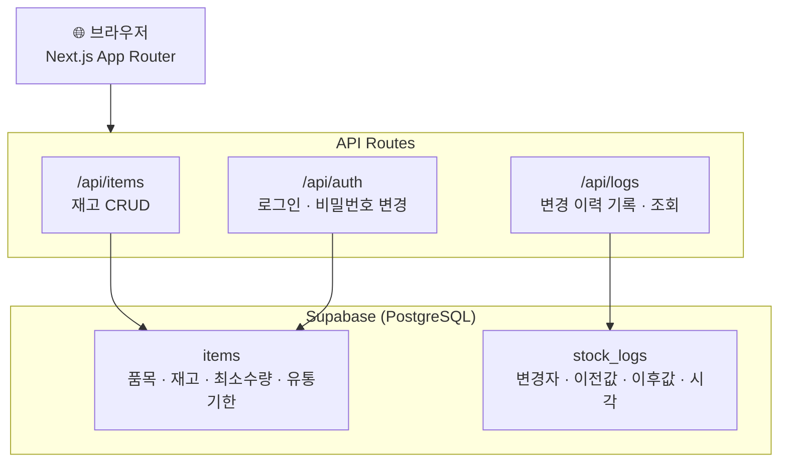
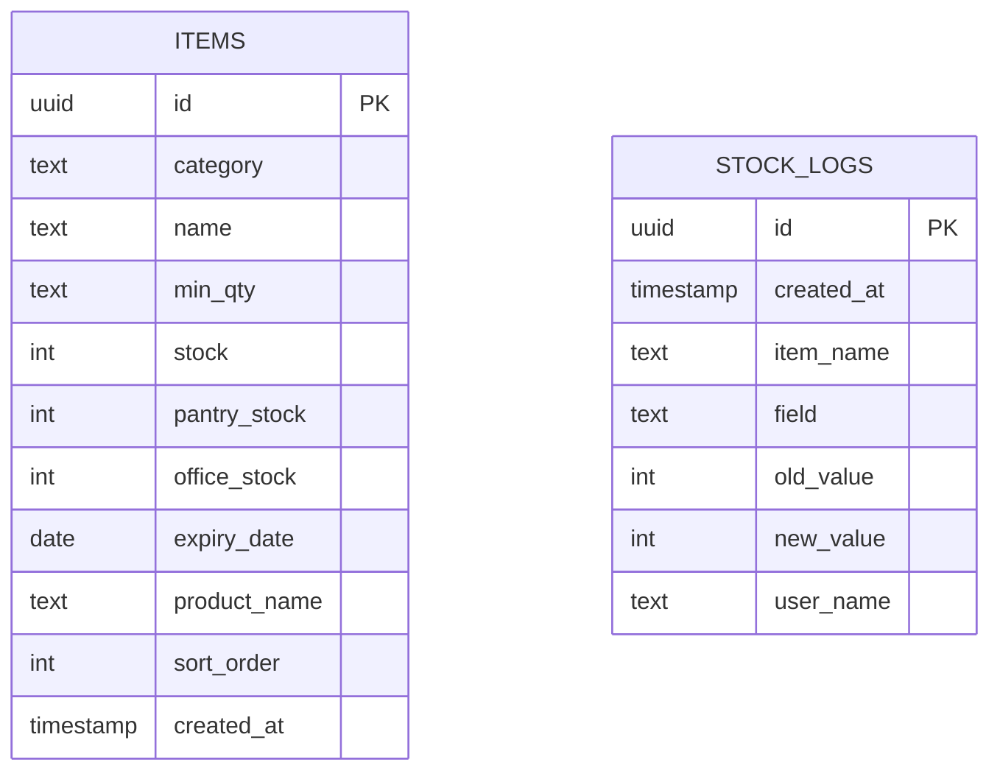

# Cafe Inventory — 카페 재고 관리 시스템

> 디저트 카페 신사역점의 실제 재고 문제를 해결하기 위해 만들었고, 지금도 현장에서 쓰이고 있습니다.

---

매일 아침 오픈 전, 매니저는 카운터·팬트리·사무실 세 곳을 직접 돌아다니며 수기로 재고를 파악했습니다. 어디에 뭐가 얼마나 있는지를 머릿속에 합산해야 했고, 어떤 품목이 부족한지는 다 돌아본 뒤에야 알 수 있었습니다. 부족한 걸 발견하면 그때서야 쿠팡과 네이버를 열어 주문할 제품을 찾았습니다.

이 흐름이 매일 반복되면서 문제가 쌓였습니다. 주문 타이밍을 놓쳐 품절이 생기고, 유통기한이 있는 품목(오믈렛·마카롱·케익)은 관리 누락으로 버리는 일도 있었습니다.

---

## 버전 히스토리

| 버전 | 날짜 | 내용 |
|------|------|------|
| v2.2 | 2026-04-22 | 대시보드 페이지 추가, 메인 하단 정리, PWA 홈 화면 설치 지원 |
| v2.1 | 2026-04-22 | UI 정리 — 로그·다크모드 버튼을 사이드 드로어로 이동, 햄버거 버튼 툴팁 추가 |
| v2.0 | 2026-04-22 | 버그 수정 — 매니저 수정 내용 오너 화면에 미반영 문제 해결 (API 캐시 비활성화) |
| v1.9 | 2026-04-20 | 폭파 이펙트 전면 재설계 — 건물 붕괴식 와르르 연출, Canvas 즉시 실행으로 렉 제거, DOM 슬라이스 순차 낙하 |
| v1.8 | 2026-04-17 | 실수 방지 undo toast, 연속 변경 로그 묶음, +/- 효과음, 개발자 계정, 로그 단건 삭제 |
| v1.7 | 2026-04-08 | 테마 2가지로 정리 — 인스타 핑크(기본) / 다크모드, 벚꽃 테마 제거 |
| v1.6 | 2026-04-08 | 3가지 테마 추가 — 기본 / 인스타 핑크(그라디언트+흰배경) / 다크모드 (딥 네이비) |
| v1.5 | 2026-04-08 | 품목 단위 배지 제거, 카테고리명 띄어쓰기 수정 ('오믈렛및마카롱' → '오믈렛 및 마카롱') |
| v1.4 | 2026-04-07 | 재고 단위 시스템 추가 — 개/박스/봉/병/% 선택, 품목명 옆 단위 배지, % 단위 0~100 제한 |
| v1.3 | 2026-04-07 | 품목 추가 UX 개선 — 초기 재고 입력 필드 추가, 필드 레이블 명시화, 드로어 이모지 제거 |
| v1.2 | 2026-04-07 | 우측 슬라이드 드로어 메뉴 — 품목 추가·최소수량·위치변경·재고초기화·계정 통합, 카테고리 선택 품목 추가 |
| v1.1 | 2026-04-06 | 전체 카운터 재고 초기화 — 확인 다이얼로그 + 15초 실행취소 |
| v1.0 | 2026-03-24 | 최초 배포 — 재고 입력, 부족 알림, 유통기한 관리, 드래그 순서 변경, 변경 이력 |

---

## 어떻게 해결할지 생각했습니다

세 곳에 흩어진 재고를 한 화면에서 합산해 보여주고, 부족 품목을 자동으로 감지해주면 아침 루틴을 바꿀 수 있겠다고 판단했습니다. 여기에 주문 연결까지 한 번에 되면, "발견 → 주문"까지의 마찰을 거의 없앨 수 있었습니다.

아래가 목표로 삼은 흐름입니다.



---

## 만들면서 신경 쓴 부분들

**재고는 세 곳을 합산해야 의미가 있었습니다.** 매장·팬트리·사무실 재고를 각각 입력하고, 합산 기준으로 최소 수량 대비 상태(위험/주의/정상)를 자동 계산합니다. 매니저가 매번 계산할 필요가 없어졌습니다.

**부족 품목은 스크롤 없이 한눈에 보여야 했습니다.** 하단 알림 대시보드에서 전 카테고리 부족 품목을 모아 보여주고, 클릭하면 해당 탭으로 이동해 그 행을 하이라이트합니다.

**품목마다 주문처 링크를 연결하기엔 관리 비용이 너무 컸습니다.** 대신 제품명을 등록해두면 🛒 버튼 하나로 쿠팡·다나와·네이버쇼핑에서 바로 검색되도록 했습니다. 재고 발견부터 주문까지 클릭 2회입니다.

**여러 명이 함께 쓰는 앱이라 권한 분리가 필요했습니다.** 오너·매니저·개발자 세 역할이 있고, 오너와 개발자는 전체 기능을 쓸 수 있습니다. 재고 변경 이력은 Supabase DB에 저장되어 누가 언제 무엇을 바꿨는지 모든 기기에서 조회할 수 있고, 개발자 계정은 로그 페이지에서 개별 로그를 직접 삭제할 수 있습니다.

**실수로 버튼을 잘못 누르는 일이 생겼습니다.** 재고를 저장할 때마다 5초짜리 실행취소 toast가 나타납니다. 같은 품목을 연속으로 수정하면 1.5초 디바운스로 묶어 로그에 한 줄만 남기고, 실행취소를 누르면 처음 값으로 한 번에 되돌아가면서 해당 로그도 함께 삭제됩니다.

**버튼 피드백이 너무 조용했습니다.** +/- 버튼을 누를 때 Web Audio API로 생성한 효과음이 납니다. 외부 파일 없이 브라우저에서 직접 생성하며, + 는 올라가는 소리, − 는 내려가는 소리로 방향감을 줬습니다.

---

## 앱의 구조

Next.js App Router 기반으로, 재고 데이터와 변경 로그는 Supabase(PostgreSQL)에 저장됩니다. API Routes가 두 테이블을 각각 담당합니다.





---

## 기술 스택

| 영역 | 기술 |
|------|------|
| Frontend | Next.js 15 (App Router), TypeScript, Tailwind CSS |
| UI | shadcn/ui, @dnd-kit (드래그앤드롭), sonner (토스트) |
| Backend | Next.js API Routes |
| Database | Supabase (PostgreSQL) |
| 인증 | 세션 기반 (오너/매니저 역할 분리) |
| 배포 | Vercel |

---

## 결과

재고 파악 → 주문까지의 흐름이 바뀌었습니다. 세 곳을 돌아다니는 대신 앱 하나를 열면 부족 품목이 바로 보이고, 주문은 클릭 두 번이면 됩니다. 유통기한 있는 품목은 캘린더로 관리되고, 누가 재고를 얼마나 바꿨는지도 이력으로 남습니다. 지금 이 시스템이 실제 카페 현장에서 매일 쓰이고 있습니다.

---

## 로컬 실행

```bash
npm install

# .env.local 설정
# NEXT_PUBLIC_SUPABASE_URL=...
# NEXT_PUBLIC_SUPABASE_ANON_KEY=...
# SUPABASE_SERVICE_ROLE_KEY=...

npm run dev
```

---

> 이 프로젝트는 **Claude Code(AI 에이전트)**와의 페어 프로그래밍으로 구현되었습니다.
> PO는 방향만 결정하고, 설계·구현·배포는 AI 에이전트가 담당하는 워크플로우로 진행했습니다.
